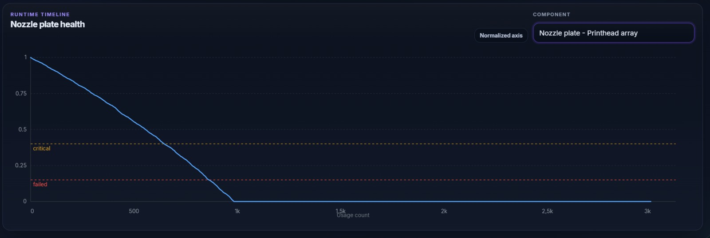
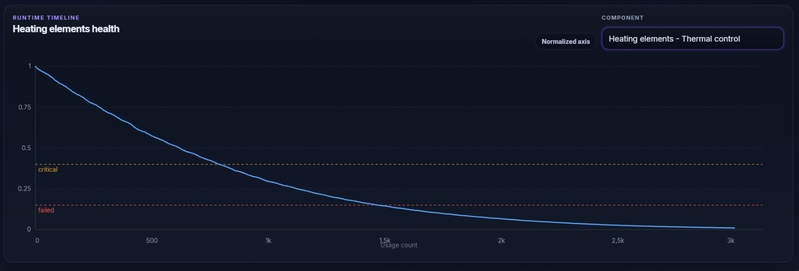
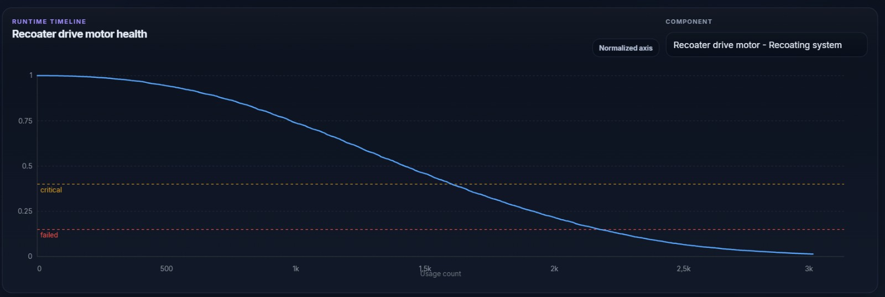

# Hackaton-UPC-2026

This repository contains a digital twin-based maintenance assistant for the HP Metal Jet S100 focused on predictive maintenance and digital twin simulation. The project models how key printer components degrade under operational and environmental stress, simulates their evolution over time, and exposes that state through services and interfaces designed to support diagnosis and maintenance decisions.

## Architecture

The solution is organized as a modular system with a clear separation between simulation, prediction, orchestration, and visualization:

- `frontend/`: React + Vite dashboard for visualizing component health, alerts, dependencies, and simulation timelines.
- `backend/`: application layer exposing the core prediction, simulation, storage, and chatbot/agent-facing services.
- `agent/`: agent logic and scripts used to support interaction, orchestration, and scenario handling.
- `model_mathematic/`: mathematical models for each subsystem and component degradation behavior.
- `data/`: synthetic histories, example contexts, and agent scenarios used to test the system.
- `docs/`, `config/`, `tests/`, and `3d-models/`: supporting material, configuration, validation, and visualization assets.

At a high level, the mathematical models generate the health and degradation behavior of each subsystem, the backend coordinates predictions and storage, and the frontend presents the results through dashboards and timelines.

## Prerequisites

Install the following tools before running the project:

- Python 3.10 or newer.
- Node.js 18 or newer, with npm.
- Git, if you are cloning the repository.
- Optional: Ollama, if you want to use the local LLM explanation flow instead of the mock LLM provider.

The backend reads environment variables from the repository root `.env` file. The current local LLM configuration uses:

```env
OLLAMA_BASE_URL=http://localhost:11434
AGENT_LLM_PROVIDER=ollama
AGENT_LLM_MODEL=llama3.2:3b
```

If Ollama is not installed or running, use the mock provider for the frontend agent panel by creating `frontend/.env.local` with:

```env
VITE_AGENT_LLM_PROVIDER=mock
```

## Installation

Clone the repository and enter the project directory:

```bash
git clone https://github.com/arnaumunozbarrera/Hackaton-UPC-2026.git
cd Hackaton-UPC-2026
```

Create and activate a Python virtual environment for the backend:

```bash
cd backend
python -m venv .venv
```

On Windows PowerShell:

```powershell
.\.venv\Scripts\Activate.ps1
```

On macOS or Linux:

```bash
source .venv/bin/activate
```

Install the backend dependencies:

```bash
python -m pip install --upgrade pip
python -m pip install -r requirements.txt
```

Install the frontend dependencies from a second terminal:

```bash
cd frontend
npm install
```

## Usage

Start the backend API:

```bash
cd backend
python -m uvicorn app.main:app --reload --host 0.0.0.0 --port 8000
```

The backend will be available at:

- API health check: `http://localhost:8000/api/health`
- Interactive API documentation: `http://localhost:8000/docs`

Start the frontend dashboard from another terminal:

```bash
cd frontend
npm run dev
```

Open the dashboard at `http://localhost:5173`.

By default, the frontend calls the backend at `http://localhost:8000`. To use a different backend URL, create `frontend/.env.local` and set:

```env
VITE_API_BASE_URL=http://localhost:8000
```

To use the Ollama-backed agent explanation flow, make sure Ollama is running and that the configured model is available. If you are not using the Ollama desktop application, start the Ollama server first:

```bash
ollama serve
```

Then pull the configured model from another terminal:

```bash
ollama pull llama3.2:3b
```

Run the automated tests from the repository root:

```bash
python -m pip install pytest
python -m pytest
```

The backend creates its local SQLite historian database automatically under `backend/storage/` when the API starts.

## Elements

The main implemented elements of the project are:

- Subsystem-level mathematical models for components such as cleaning interface, heating elements, insulation panels, linear guide, nozzle plate, recoater blade, recoater drive motor, temperature sensors, and thermal firing resistors.
- A logic engine to combine subsystem behavior into machine-level health interpretation.
- A backend structure for prediction, simulation, schema definition, storage, and agent/chatbot integration.
- A frontend dashboard with component selection, health visualization, alerts, dependency impact display, and timeline-based monitoring.
- Synthetic data and agent scenarios to validate the behavior of the platform under different maintenance situations.

## Results & Conclusion

The implemented prediction layer combines several degradation functions depending on the physical behavior of each component family:

- Linear degradation for components whose wear grows approximately in proportion to use and environmental stress.
- Exponential decay for thermal and electrical components whose degradation accelerates with accumulated operating stress.
- Weibull-based degradation for components with fatigue behavior and increasing failure risk over time.

### Linear Prediction Function

The linear formulation is used for components such as the recoater blade, linear guide, cleaning interface, temperature sensors, and insulation panels.



### Exponential Prediction Function

The exponential formulation is used for components such as heating elements and thermal firing resistors, where damage compounds under repeated thermal and electrical cycles.



### Weibull Prediction Function

The Weibull formulation is used for the recoater drive motor to represent fatigue accumulation and a non-linear increase in failure probability as effective age grows.



### Conclusion

The current prototype delivers a coherent set of prediction functions that are traceable, deterministic, and aligned with the physical interpretation of each subsystem. The main value of the model is not a single universal degradation curve, but the use of the most suitable mathematical behavior for each component type so the digital twin can explain why degradation happens, how it evolves, and when maintenance risk starts to become relevant.

## Future Improvements

Two complementary improvement approaches are considered:

1. Add more data to the model.
   This includes incorporating more constant and component-specific parameters such as humidity, degradation rate, temperature exposure, contamination patterns, maintenance history, and other operational variables that affect wear and failure behavior.

   The utility of this improvement is that the model would stop relying on a relatively compact synthetic description of machine usage and would start representing a richer operational context. In practice, this would allow the digital twin to:

   - Distinguish better between components that fail for similar reasons but under different operating regimes.
   - Capture slower effects such as cumulative environmental exposure, seasonal conditions, or long-term maintenance quality.
   - Reduce oversimplified assumptions in the degradation curves by conditioning them on more realistic combinations of stress factors.
   - Improve the quality of both simulation and prediction outputs, because the backend could generate more nuanced health trajectories instead of a limited number of standard patterns.

   In a more advanced version, this could also support better calibration with real telemetry if production data becomes available, making the model progressively less synthetic and more representative of machine behavior in the field.
2. Focus the solution on warning generation and maintenance date estimation.
   The goal is to implement a system more centered on early warnings and on estimating the date when maintenance should be performed.

   The utility of this improvement is mainly operational. Instead of using the model only to observe degradation, the platform would become a more actionable decision-support tool. This would make it possible to:

   - Trigger interpretable alerts before a component reaches a critical state, giving operators time to react.
   - Estimate when a maintenance intervention should ideally be scheduled, balancing failure risk against unnecessary early replacement.
   - Coordinate maintenance windows with production demand, reducing disruption to machine availability.
   - Prioritize interventions across components and subsystems according to risk, urgency, and expected operational impact.
   - Support cost reduction by avoiding both unplanned downtime and excessive preventive maintenance.

   In business terms, this would make the system more useful for planning, not only for monitoring. The final value would come from converting health predictions into concrete recommendations: when to intervene, why that intervention is needed, and what operational risk is avoided by acting at that moment.
